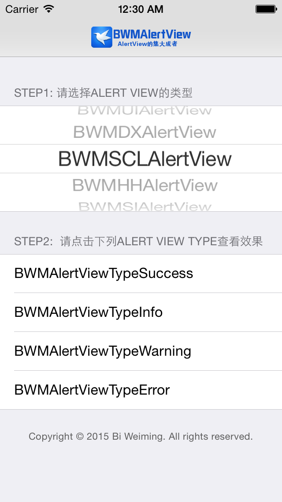

# BWMAlertView

[](LICENSE.md) 
[](#)
[](#) 

It integrates multiple third-party alertView, use the adapter mode built.

它集成了多种第三方alertView ，使用适配器模式建造。

Successful adaptation of the following third-party AlertView:

成功适配了以下第三方AlertView：

* UIAlertView
* SIAlertView
* SCLAlertView
* HHAlertView 
* DXAlertView

#### Screenshot



## Requirements

* Xcode 6 or higher
* Apple LLVM compiler
* iOS 7.0 or higher
* ARC

## Demo

Build and run the `BWMAlertView.xcodeproj` project in Xcode.

## Installation

Drag `BWMAlertView/Classes` files into your project, and add `#include "BWMAlertView.h"` to the top of classes that will use it.

## Usage

```Objective-C
// 获取已经选择的类
Class AlertViewClass = NSClassFromString(_alertViewClassSelectedName);

// 初始化BWMAlertView
BWMAlertView<BWMAlertView> *theAlertView = [[AlertViewClass alloc]
										 initWithTitle:@"标题 Title"
										 message:@"写点什么吧... Write about it ..."
										 type:alertViewType //BWMAlertViewType
										 targetVC:self];

// AlertViewClass也就是BWMAlertView具体类，在使用中也可以直接这样
/*
 BWMAlertView<BWMAlertView> *theAlertView = [[BWMAMSmoothAlertView alloc] initWithTitle:@"标题 Title" message:@"写点什么吧... Write about it ..." type:BWMAlertViewTypeSuccess targetVC:self];
 
 也就直接采用了BWMAMSmoothAlertView
 */


/* 添加按钮，上限两个。并且BWMAlertViewButtonType类型BWMAlertViewButtonTypeOKey、BWMAlertViewButtonTypeCancel只能有且限一个 */

// 添加确定按钮
[theAlertView addButtonWithTitle:@"确定"
				   buttonType:BWMAlertViewButtonTypeOKey
					callBlock:^(BWMAlertView<BWMAlertView> *alertView) {
						NSLog(@"确定 %s", __FUNCTION__);
						
						[alertView dismiss]; // dismiss
					}];


// 添加Cancel按钮
[theAlertView addButtonWithTitle:@"关闭"
				   buttonType:BWMAlertViewButtonTypeCancel
					callBlock:^(BWMAlertView<BWMAlertView> *alertView) {
						NSLog(@"关闭 %s", __FUNCTION__);
						
						[alertView dismiss]; // dismiss
					}];

// 确定按钮和Cancel按钮可以只添加一个，也可以同时出现，但是它们仅能各出现一次！ -- important!

[theAlertView show];
```

#### BWMAlertView.h (An Abstract Class: `Adaptee`)
```Objective-C
@class BWMAlertView;
@protocol BWMAlertView;

static NSString * const kTipsTitleString = @"温馨提示";
static NSString * const kTipsTitleErrorString = @"错误提示";
static NSString * const kOkeyBtnString = @"确定";
static NSString * const kCancelBtnString = @"取消";

#define SafeSelf(safeSelf) __weak typeof(&*self)safeSelf = self

/** BWMAlertViewType也就是AlertView的用途，类型 */
typedef NS_ENUM(NSUInteger, BWMAlertViewType) {
    BWMAlertViewTypeSuccess = 0,
    BWMAlertViewTypeInfo,
    BWMAlertViewTypeWarning,
    BWMAlertViewTypeError
};

/** BWMAlertViewButtonType 按钮的类型 */
typedef NS_ENUM(NSUInteger, BWMAlertViewButtonType) {
    BWMAlertViewButtonTypeOKey,
    BWMAlertViewButtonTypeCancel
};

typedef void(^BWMAlertViewTaskBlock)(BWMAlertView<BWMAlertView> *alertView);

@protocol BWMAlertView <NSObject>

/** 添加按钮，上限两个。并且BWMAlertViewButtonTypeOKey、BWMAlertViewButtonTypeCancel只能有且限一个 */
- (void)addButtonWithTitle:(NSString *)title buttonType:(BWMAlertViewButtonType)buttonType callBlock:(BWMAlertViewTaskBlock)callBlock;

/** 显示 */
- (void)show;

/** 消散 */
- (void)dismiss;

@end

// BWMAlertView目前正在火热加入各种第三方AlertView中，请Q我724849296 By Bi Weiming
/** BWMAlertView集成了N个AlertView，他们接口统一，无限切换。它针对抽象编程，符合里氏代换原则、依赖倒置原则。 */
@interface BWMAlertView : NSObject

@property (strong, nonatomic, readwrite) NSString *title;
@property (strong, nonatomic, readwrite) NSString *message;
@property (assign, nonatomic, readwrite) BWMAlertViewType type;
@property (weak, nonatomic, readwrite) UIViewController *targetViewController;

/** 初始化BWMAlertView */
- (instancetype)initWithTitle:(NSString *)title
                      message:(NSString *)message
                         type:(BWMAlertViewType)type
                     targetVC:(UIViewController *)targetVC;

@end
```

#### Adapter Mode

<table>
	<tr>
		<td></td>
	</tr>
	<tr>
		<td>将一个类的接口转换成客户希望的另外一个接口。Adapter模式使得原本由于接口不兼容而不能一起工作的那些类可以一起工作。——Gang of Four。
		</td>
	</tr>
</table>

[Read More.](http://blog.csdn.net/lovelion/article/details/8624325)

```Objective-C
// BWMAlertView抽象类
#import "BWMAlertView.h"

// BWMAlertView具体类
#import "BWMSIAlertView.h"
#import "BWMSCLAlertView.h"
#import "BWMHHAlertView.h"
#import "BWMUIAlertView.h"
#import "BWMDXAlertView.h"
```

关于更多设计模式的用例，您可以[参考](https://github.com/Nihility-Ming/Design_Patterns_In_Objective-C)我写的一些Examples.

## LICENSE

`BWMAlertView` is available under the MIT license.

## Contact

If you have any questions or suggestions, contact me `QQ724849296` or call `+8615918550637`, please.
